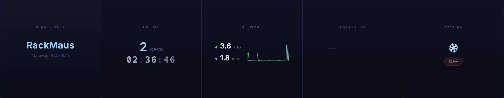
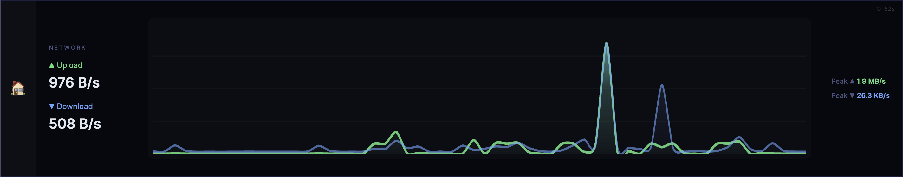

[](https://github.com/matuscvengros/pirack-control/actions/workflows/build.yml)
[](https://github.com/matuscvengros/pirack-control/actions/workflows/release.yml)


# PiRack Control

A dashboard for the [GeeekPi 6.91" 1424×280 LCD Touch Screen](https://www.amazon.com.au/dp/B0G337KQS6) 1U rack display, built with SvelteKit. Runs on a Raspberry Pi, serves two interfaces: a touch-optimised dashboard for the LCD and a configuration page for LAN browsers.



Tap any panel to enter a detailed view:



## Modules

| Module | Strip | Expanded |
|--------|-------|----------|
| Rack Info | Name + subtitle | — |
| Uptime | Days + HH:MM:SS | Large display |
| Network | Upload/download + sparkline | Full traffic graph |
| Temperature | Current + 24h mini chart | 24h graph with stats |
| Cooling | ON/OFF badge | Toggle switch + relay status |

The module system is extensible — add new modules under `src/lib/modules/` without changing core code.

## Run

**Local development:**

```bash
npm install
npm run dev -- --host 0.0.0.0 --port 3000
```

**Docker (pulls from GHCR by default):**

```bash
docker compose up -d
```

**Docker (local build):**

```bash
PIRACK_IMAGE=pirack-control docker compose up -d --build
```

> On non-Pi hosts, remove the `devices` section from the compose file.

## Configuration

Open `http://<host>:3000/config` to manage modules, reorder panels, and change settings.

App config persists in `./data/config.json` (mounted as a Docker volume).
